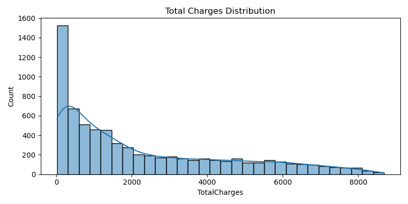
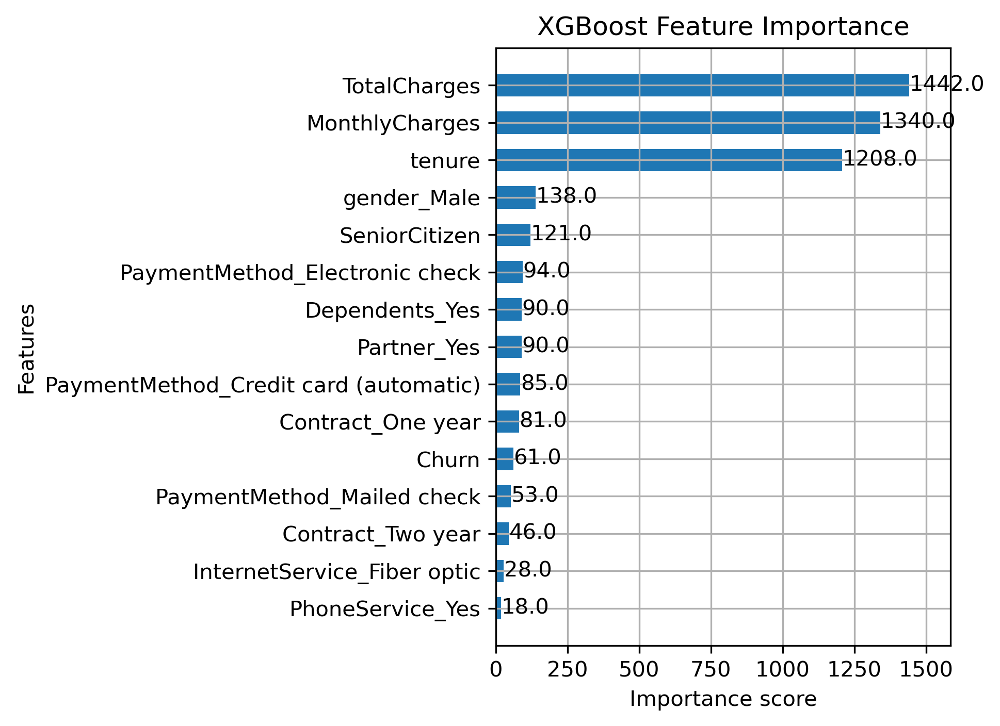

# 📈 Customer Lifetime Value (CLV) Prediction Application

An end-to-end machine learning solution to **predict Customer Lifetime Value (CLV)** using a real-world telecom dataset. This project covers the complete ML pipeline — from preprocessing and modeling to deployment on AWS — and features a responsive web interface built with Streamlit.

---

## 🧠 Project Summary

- 📊 **Goal**: Predict how valuable a customer will be over their lifetime using behavioral and demographic data.
- 🛠️ **Stack**: Python, XGBoost, Scikit-learn, Streamlit, Docker, AWS (ECS, ECR), Pandas, NumPy, Seaborn.
- 🚀 **Deployment**: Fully containerized and deployed to AWS.
- 💻 **App Interface**: Supports both single and bulk CLV predictions via a user-friendly web interface.

---

## 📁 Dataset

- **Source**: [Telco Customer Churn Dataset (Kaggle)](https://www.kaggle.com/datasets/blastchar/telco-customer-churn)
- **Rows**: 7043 customers
- **Features**: Gender, tenure, MonthlyCharges, TotalCharges, etc.

---

## 🔍 Key Phases

### ✅ 1. Data Preprocessing
- Handled missing values in `TotalCharges`
- One-hot encoded categorical variables
- Engineered new features for modeling

### ✅ 2. Exploratory Data Analysis (EDA)
- Visualized feature distributions and relationships
- Created key plots to explore churn impact and CLV spread

### ✅ 3. Modeling
- Trained models: `Linear Regression`, `XGBoost Regressor`
- Evaluated with:
  | Model               | MSE       | R² Score  |
  |---------------------|-----------|-----------|
  | Linear Regression   | 4803.33   | 0.99907   |
  | XGBoost Regressor   | 2873.85   | 0.99944   |

- Identified key drivers of CLV:  
  `TotalCharges`, `MonthlyCharges`, `tenure`

### ✅ 4. Web App Development
- Built using **Streamlit** for rapid prototyping
- Added interactive input forms for predictions
- Used Seaborn for embedded data visualizations

### ✅ 5. Cloud Deployment
- Dockerized the app and deployed via AWS ECS & ECR
- Achieved 100% deployment success rate

---

## 📸 Visualizations

| Plot | Description |
|------|-------------|
|  | Distribution of Total Charges |
|  | Distribution of Monthly Charges |
|  | Distribution of Customer Tenure |
|  | XGBoost Feature Importance Chart |

---

## 🛠️ How to Run Locally

1. **Clone the repo**
   ```bash
   git clone https://github.com/YOUR_USERNAME/clv_prediction_project.git
   cd clv_prediction_project
   ```

2. **Create a virtual environment**
   ```bash
   python -m venv venv
   source venv/bin/activate  # Windows: venv\Scripts\activate
   ```

3. **Install dependencies**
   ```bash
   pip install -r requirements.txt
   ```

4. **Run the app**
   ```bash
   streamlit run streamlit_app.py
   ```

---

## 📦 Deployment Stack

- Docker: for containerization
- AWS ECS: for managed deployment
- AWS ECR: to store Docker images
- Streamlit: app frontend
- GitHub: version control and collaboration

---

## 👨‍💻 Author

**Joshua Paul Muppidi**  
M.S. in Data Science – Gannon University  
GitHub: [@muppidijoshua](https://github.com/muppidijoshua)

---

## 📄 License

This project is licensed under the MIT License.
